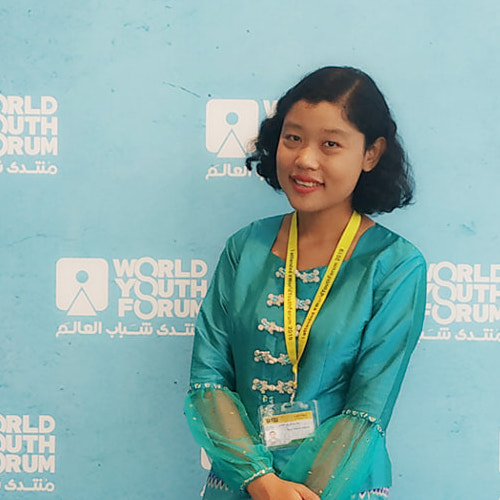
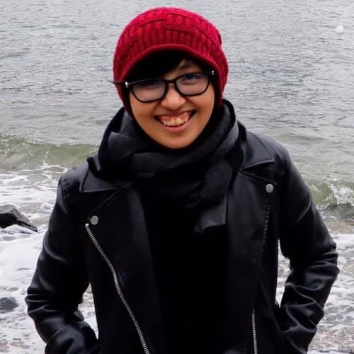
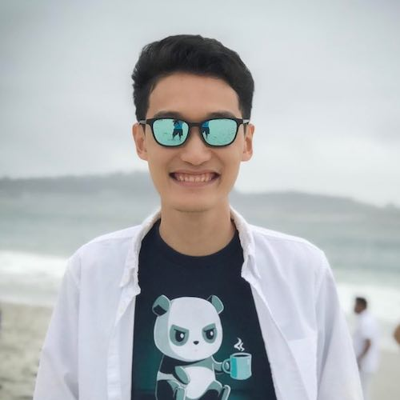

## Welcome

We are a community of Burmese Natural Language Processing (NLP) enthusiasts. Our mission is to advance Burmese language technology by creating resources in Burmese language, developing tools and models for Burmese language, and build a community of researchers and experts working on Burmese language technology. We are inspired by similar amazing communities such as [Masakhane](https://www.masakhane.io/) and [Turkic Interlingua](https://turkic-interlingua.org/).

## Projects

### Myanmar NLP Reading Group

> This is a community-lead NLP study group inspired by the [WING Reading Goup at NUS](https://wing-nus.github.io/cs6101/). We will mainly follow the [Stanford NLP's CS224N](http://web.stanford.edu/class/cs224n/index.html#schedule) course materials, with slight modification. All the discussions will be in Burmese and videos of all the meetings will be posted on YouTube.
> Check out our [course website](https://myanmarnlp.github.io/reading-group/) or [YouTube channel](https://www.youtube.com/channel/UCC0FoFXkaI7C9V9emgtUAdA/featured) to learn more.

## Organizers

 |  |  | 
------------ | ------------- | ------------- | -------------
[Aye Hninn Khine](https://www.linkedin.com/in/ayehninnkhine) 🇹🇭 | [Cho Zin Tun](https://www.linkedin.com/in/cho-zin-tun-9217a2a3) 🇸🇬 | [Phu Mon Htut](https://phumonhtut.me) 🇺🇸 | [Soe Lynn](https://www.linkedin.com/in/realsoelynn) 🇺🇸
PhD Candidate | Data Scientist | PhD Candidate | Senior Software Engineer
Prince of Songkla University | Visa | New York University | PayPal

#### © Myanmar NLP Group.
